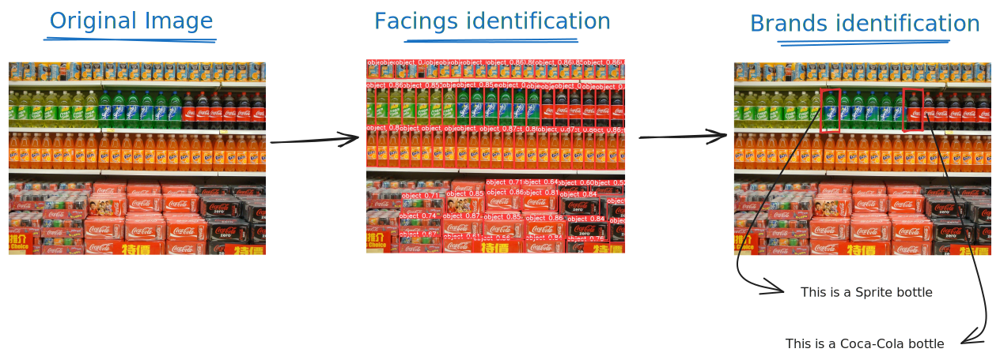
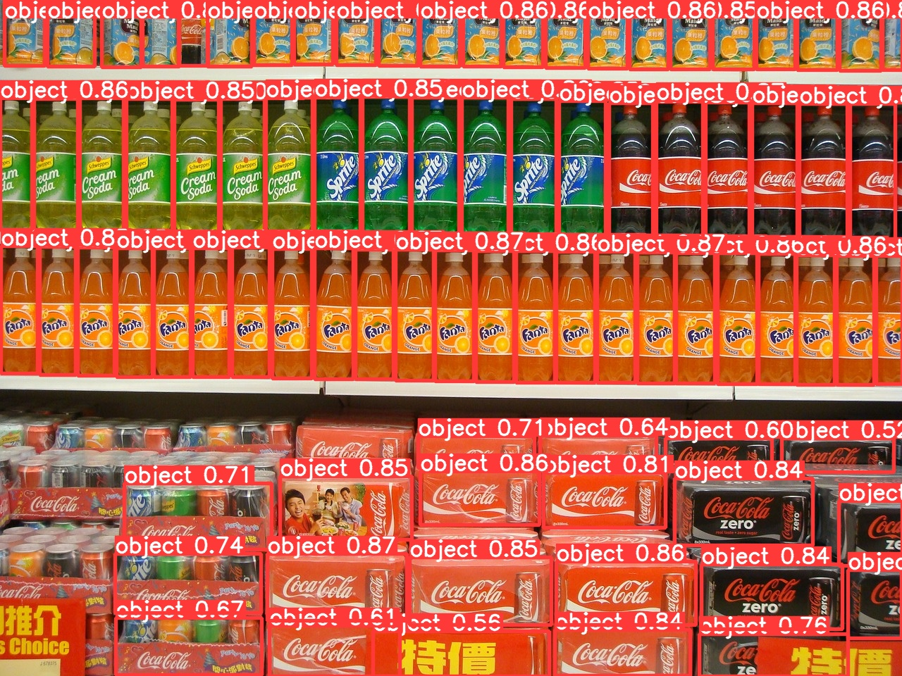
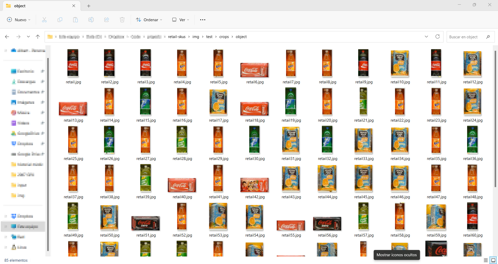
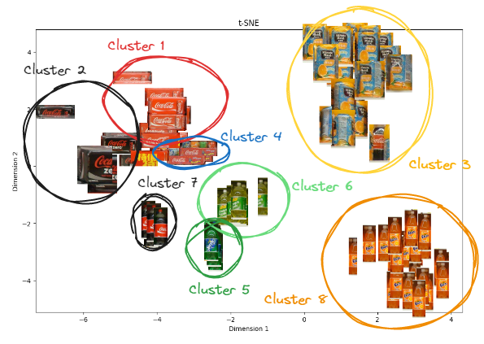
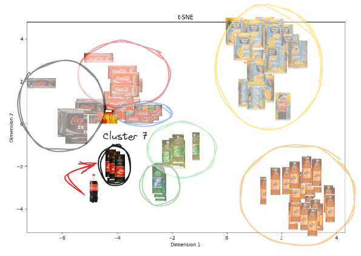

# Facings product identifier using YOLOv8 and image embeddings

This repository contains the implementation of a facings identifier using YOLOv8 and image embeddings. The goal of this project is to count the number of facings (product instances) of each product present on shelves in a retail store using computer vision techniques.

- [Facings product identifier using YOLOv8 and image embeddings](#facings-product-identifier-using-yolov8-and-image-embeddings)
  - [Introduction](#introduction)
    - [What is YOLOv8?](#what-is-yolov8)
    - [What are the Image Embeddings?](#what-are-the-image-embeddings)
  - [Mehodology](#mehodology)
    - [Identifying all skus from a shelf image](#identifying-all-skus-from-a-shelf-image)
    - [Predicting brand for every detected sku](#predicting-brand-for-every-detected-sku)
      - [grouping the products in clusters](#grouping-the-products-in-clusters)
      - [Building the knowledge base](#building-the-knowledge-base)
    - [Testing the model](#testing-the-model)
  - [How to  run the model](#how-to--run-the-model)
    - [Preparing the environment](#preparing-the-environment)
  - [Conclusions](#conclusions)
  - [Links](#links)

## Introduction
Accurate and efficient inventory management is crucial in the retail industry for optimizing operations and improving the customer experience. One significant challenge faced by retailers is accurately counting the number of product facings—the individual instances of products displayed on store shelves.

Manual counting of product facings can be time-consuming and error-prone, especially in large retail environments. To address this challenge, computer vision techniques offer an automated solution. By leveraging algorithms and models, retailers can analyze shelf images to detect and count product facings accurately.

The facings identifier using YOLOv8 and image embeddings presented in this project is an example of utilizing computer vision techniques. By combining YOLOv8, an advanced object detection algorithm, with image embeddings that capture essential visual features, the system can automatically detect and count product facings with precision. This approach improves inventory management efficiency, provides insights into product availability and shelf performance, and enhances customer satisfaction.

In summary, automating the counting of product facings through computer vision offers retailers valuable benefits, such as streamlined operations, reduced errors, and improved customer service.

### What is YOLOv8?
**YOLO is a popular real-time object detection algorithm that performs object detection** directly on the entire image in a single pass, providing faster results compared to other methods. YOLOv8[^1], developed by Ultralytics, is the latest version of this algorithm, leveraging advancements in deep learning and computer vision to offer superior speed and accuracy. It can be easily adapted to different hardware platforms and is suitable for various applications.


### What are the Image Embeddings?
Image embeddings are compact **numerical representations that capture the unique characteristics of an image**. They are generated using advanced deep learning models trained on large image datasets. These representations encode high-level information about the content of an image, enabling computers to understand and compare images effectively.

By **using image embeddings, we can measure the similarity between images**, perform image search, and organize images into meaningful categories. In the facings identifier project, image embeddings help identify the brand of each product facing by comparing the embeddings of different product images.

In summary, image embeddings are powerful tools in computer vision that allow us to represent and analyze images in a way that computers can understand, enabling various applications in image recognition, search, and organization.

In this project, image embeddings are utilized to identify the product name of each identified facing.

## Mehodology

The methodology for the facings identifier using YOLOv8 and image embeddings involves two steps:
1. identifying SKUs from a shelf image
2. predicting the brand for each detected SKU.

In the first step, a **YOLOv8 model is trained using the SKU110K dataset to detect SKUs in shelf images**. This model can predict bounding boxes and labels for each SKU, providing valuable information for inventory management.

The second step focuses on **predicting the product of each detected facing. This is done by leveraging image embeddings**, which are numerical representations capturing essential image features. The embeddings are generated using pre-trained deep learning models and compared to identify product clusters.

By associating clusters with product names in a knowledge base, the model can predict the product of a new facing image based on similarity to known clusters. This enables accurate counting of facings and facilitates inventory management in retail stores.

In summary, the methodology combines YOLOv8 for SKU detection and image embeddings for brand prediction, enabling efficient and accurate counting of facings using computer vision techniques.


### Identifying all skus from a shelf image
For this step, a model was trained using the YOLOv8m (medium) model and the SKU110K dataset[^2]. Due to hardware constraints, the training was performed using a Kaggle notebook. The notebook and the model weights are available [here](https://www.kaggle.com/code/albertferre/).

To identify SKUs in an image, the following code snippet demonstrates the usage of the trained model:
```python
from ultralytics import YOLO

model = YOLO('best.pt') # weights loading

model.predict(
    source="retail_shelf.jpg",
    save=True,
    save_crop=True,
    conf=0.5,
    project="img",
    name="train",
)
```


During the detection process, image crops for each detected SKU are saved using the `save_crop` parameter, which will be used in the second step.



### Predicting brand for every detected sku
#### grouping the products in clusters
To predict the product for each facing crop, an embedding model is applied to identify different product clusters using cosine similarity. The t-SNE[^3] technique, a statistical method for visualizing high-dimensional data, helps to visualize this process. In the t-SNE embeddings representation, similar product crops are grouped together.

When a new unknown crop is added, it is placed close to the most similar product crop based on the embeddings. This allows us to assume that the unknown product is the same as the closest crops.


In this [notebook](notebooks/tsne_embeddings._plot.ipynb) you can find an implementation of the T-SNE
#### Building the knowledge base
However, the model does not know the names of each cluster. Hence, manual work is required to classify the crops into folders with corresponding descriptions. This step is equivalent to renaming all the clusters, such as "Cluster 1" becoming "Coca-Cola can" and "Cluster 2" becoming "Coca-Cola Zero can," and so on.


This knowledge base is used for further predictions and impacts the predictions in two aspects:

* The predictions are limited to the products that have been classified.
* The predictions are more accurate with a larger number of crops available for comparison.
To predict the product of a new facing image, refer to this [notebook](notebooks/predict_image_product.ipynb) where all these techniques are implemented

### Testing the model
For testing purposes, an image taken in a supermarket is used. The knowledge base for this image includes only a specific set of products, so the model's performance is expected to be good only for those particular products.

*a desenvolupar*

## How to  run the model
### Preparing the environment
Assuming you have Conda installed on your system:
**Creating the environment**
``` Bash
conda env create -f env.yaml
```

**Activating the environment**
``` Bash
conda activate facings-identifier
```
**Identifiyng crops from a shelf image**
``` Bash
python main.py
```
The results will be stored in the folder ```data\output```


## Conclusions
It is possible to build software capable of extracting important data from images. However, it requires manual work to expand the knowledge base with new market products. Additionally, the performance might not be entirely accurate if the images taken are not frontal. Training a YOLO model with a larger pre-trained model could potentially minimize this error.


## Links

https://github.com/MathMagicx/JupyterNotebooks/blob/master/ImageRecommenderResnet18/Recommending%20Similar%20Images.ipynb

https://github.com/MathMagicx/JupyterNotebooks

[^1]: https://github.com/ultralytics/ultralytics
[^2]: https://www.kaggle.com/datasets/thedatasith/sku110k-annotations
[^3]: https://en.wikipedia.org/wiki/T-distributed_stochastic_neighbor_embedding

